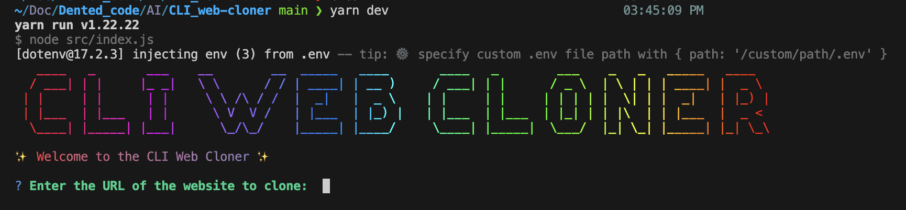

# CLI Web Cloner

A simple command-line tool to create a basic static clone of a website's landing/ public pages (HTML, CSS, JS). Inspired by Codex but intentionally lightweight — this project demonstrates a CLI→server pattern where the CLI collects a URL and a backend/LLM helps analyze and prepare downloadable/static assets.

> NOTE: This repository contains a CLI frontend (Node) and expects a server-side component for reliable production cloning (CORS, dynamic JS, authentication, rate limits). The included LLM integration is for analysis/decision-making and may require an API key.

---

## Features

- Minimal CLI to accept a URL and run an analysis flow
- Spinner and readable console banner for UX
- Calls an LLM/helper (via `userQuery`) to analyze cloning feasibility
- Designed to be extended with a server that fetches, rewrites, and packages assets (zip)

---

## Prerequisites

- Node.js 16+ (or as required by your dependencies)
- npm or yarn
- (Optional) LLM/API key environment variable if you wire `userQuery` to an external provider

---

## Install & Run

Clone the repo and install dependencies:

```bash
git clone https://github.com/Mahesh0426/CLI-web-cloner_AI.git
cd CLI_web-cloner
npm install
```

Run directly:

```bash
node src/index.js
```

Install globally for convenience (optional):

```bash
npm link
# then run
cli-web-cloner
# or, if package.json defines a bin name, use that command
```

---

## Usage

1. Start the CLI:

   - node src/index.js
   - or the linked global command

2. Enter the public URL when prompted (must start with `http://` or `https://`).

3. The app will:
   - Show a banner
   - Run a short initial analysis spinner
   - Call the LLM/helper to analyze the site and recommend/prepare cloning steps
   - Print results and next steps

Example:

```text
$ node src/index.js
```

<p align="center">
  
</p>

---

## Implementation notes

- The CLI is located at `src/index.js` (shebang present for direct execution).
- LLM/analysis is invoked via `userQuery` (see `src/ask.js`).
- Full cloning (fetching remote HTML/assets, rewriting links, packaging) belongs in a server component. Browsers/CLIs cannot bypass cross-origin restrictions without server-side fetches.

---

## Security & Legal

- Only clone public pages you are authorized to copy.
- Do not attempt to clone content behind authentication or that violates terms of service or copyright.
- The tool is intended for learning, testing, or archiving your own/public domain pages.

---

## Contributing

- Open issues for bugs or feature requests.
- PRs should include tests or manual test instructions.
- Suggestion: add a server module (Node/Express) that accepts a URL, fetches assets, rewrites links, and returns a zip.

---

## License

MIT — see LICENSE file for details.
